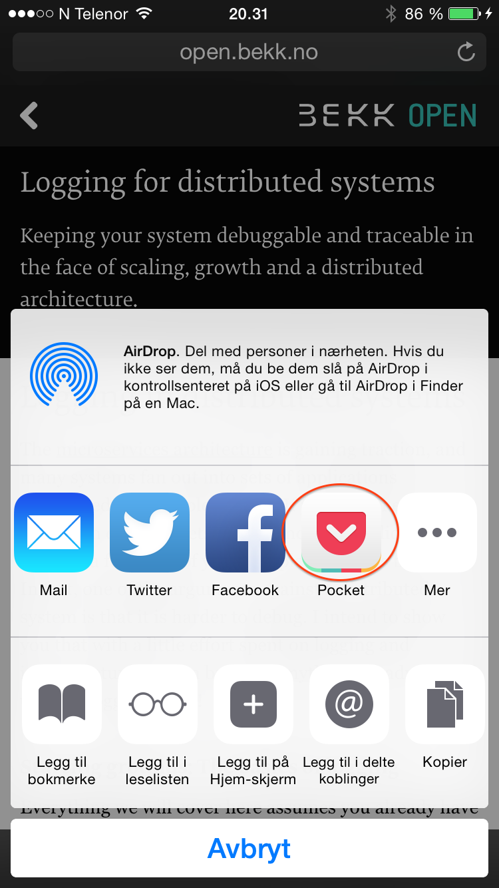
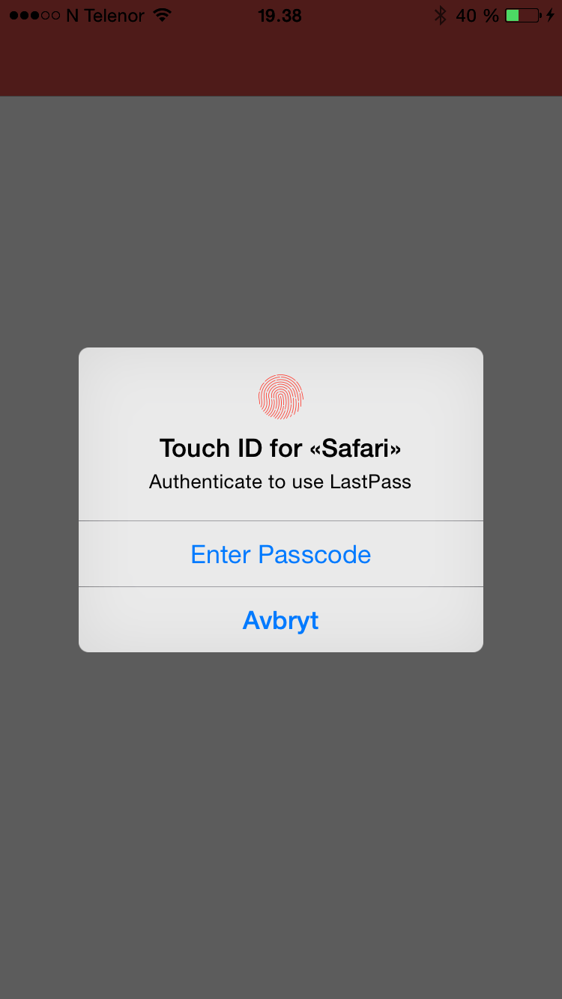
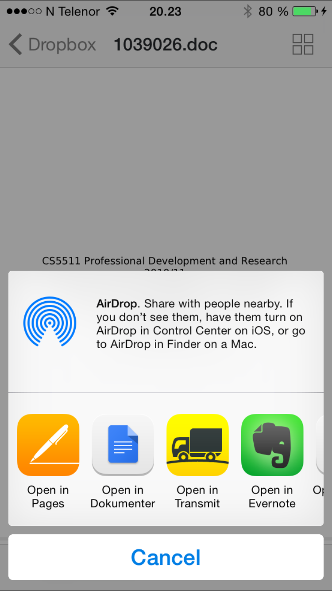
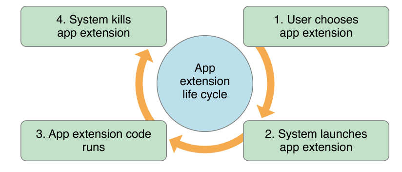
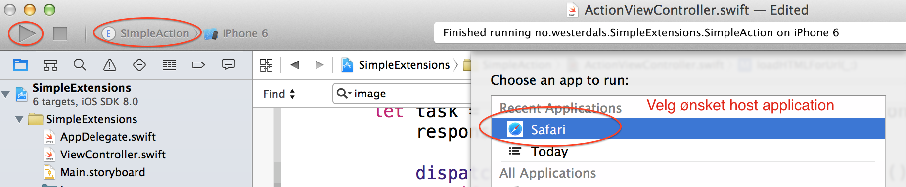
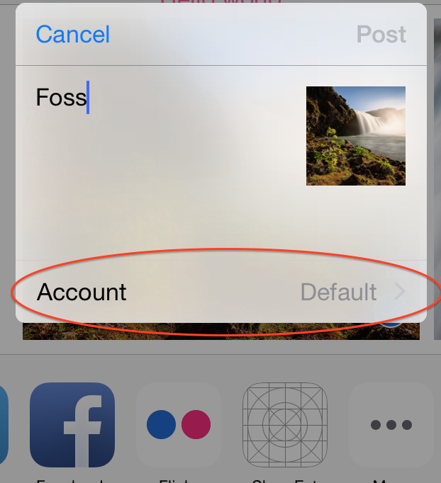
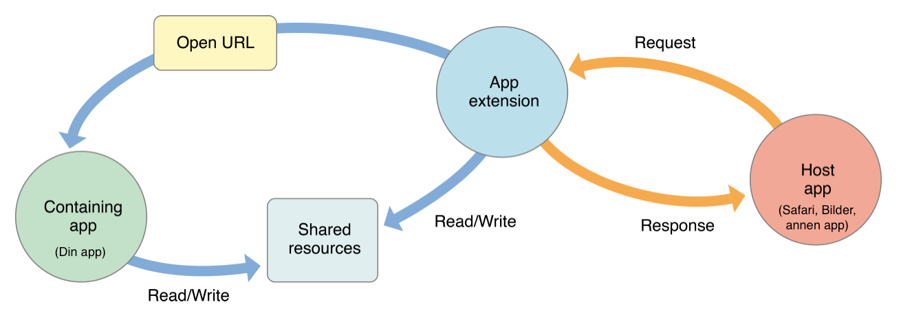
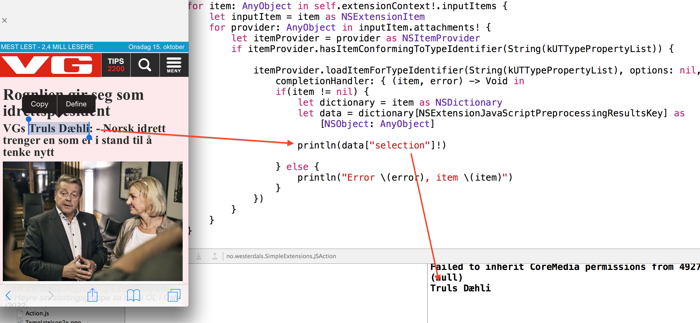

# [fit]PG5600
# [fit]iOS programmering
## Forelesning 8

---

# Sist gang

* Debugging
* Swift og gjenbruk av kode
  * Bundles
  * Rammeverk
* Tråder og asynkronitet
* Snakke med internett
* Cloud Kit

---

# Agenda

# [fit]App extensions

---

# Typer app extensions

* Today
* Share
* Action
* Photo Editing
* Document Provider / Storage Provider
* Custom Keyboard

---

# Today


---

# Today


---

# Share



---

# Action


---

# Action



---

# Photo editing


---

# Document picker 
### (Document provider)


---

# Storage Provider
### (Document provider)



---

# Custom keyboards


---

# App extensions

* Extensions må være del av en app
* Extensions lages som et nytt target for en eksisterende app
* Extensions blir installert parallelt med appen
* Brukerne må aktivt ta i bruk extensions
* Extensions har noen begrensninger i hvilke APIer som kan brukes
* Containing app og extensions kjøres separat og med egne livssykluser

---



---

> "To pass app review, your containing app must provide functionality to users; it can’t just contain app extensions."
- App Extension Programming Guide


---

# Terminologi


---

# Kjør og debug



---

# [fit]Today
## Eksempel

---

# Eksempel: Today

```swift
class TodayViewController: UIViewController, NCWidgetProviding {
        
    @IBOutlet weak var label: UILabel!

    func widgetPerformUpdateWithCompletionHandler(completionHandler: ((NCUpdateResult) -> Void)!) {
        // Perform any setup necessary in order to update the view.

        // If an error is encountered, use NCUpdateResult.Failed
        // If there's no update required, use NCUpdateResult.NoData
        // If there's an update, use NCUpdateResult.NewData

        self.label.text = NSDate().description
        completionHandler(NCUpdateResult.NewData)
    }
}
```

---

# [fit]extensionContext

---

# extensionContext

* Tilgjengelig i din app med context fra host, eks:
  * Hvilken side står man på i Safari når man trykket på action?
  * Hvilke bilde(r) er valgt når du trykker del?

---

# [fit]Share
## Eksempel

---

# Share extensions

* Presenterer en dialog hvor brukere kan dele data (redigere og poste)
* Som standard arver man fra `SLComposeServiceViewController` som gir en del gratis: preview, validering, animasjon, konfigurasjon, gui
* Kan gå helt custom med egen ViewController

---


---

# Eksempel konfigurering av options

```swift
override func configurationItems() -> [AnyObject]! {
    // To add configuration options via table cells at the bottom of the sheet, return an array of SLComposeSheetConfigurationItem here.
    
    let vc = self.storyboard?.instantiateViewControllerWithIdentifier("configController") as UIViewController
    
    let config = SLComposeSheetConfigurationItem()
    config.title = "Account"
    config.value = "Default"
    config.tapHandler = {
        self.pushConfigurationViewController(vc)
    }
    return [config]
}
```

---

# Eksempel konfigurering av options



---

# [fit]Action
## Eksempel

---

# Eksempel: Vis HTML action

```swift
class ActionViewController: UIViewController {

    @IBOutlet weak var textView: UITextView!

    override func viewDidLoad() {
        super.viewDidLoad()
    
        // Get the item[s] we're handling from the extension context.
        // TODO
    }
    
    func loadHTMLForUrl(url : NSURL) {
        // TODO
    }

    @IBAction func done() {
        self.extensionContext!.completeRequestReturningItems([], completionHandler: nil)
    }

}
```

---

```swift
// For alle extensionItems...
for item: AnyObject in self.extensionContext!.inputItems {
    let inputItem = item as NSExtensionItem

    // Se på alle itemProviders...
    for provider: AnyObject in inputItem.attachments! {
        let itemProvider = provider as NSItemProvider
        
        // Se om de er en URL
        if itemProvider.hasItemConformingToTypeIdentifier(String(kUTTypeURL)) {
        
            itemProvider.loadItemForTypeIdentifier(String(kUTTypeURL), 
                options: nil, completionHandler: { (item, error) -> Void in
                
                if let url = item as? NSURL {
                   self.loadHTMLForUrl(url)
                }
            })
        }
        
    }
}
```

---

```swift
func loadHTMLForUrl(url: NSURL) {
    let session = NSURLSession.sharedSession()
    let task = session.dataTaskWithURL(url, 
        completionHandler: { (data, response, error) -> Void in
        
        dispatch_async(dispatch_get_main_queue(), { () -> Void in
            if data != nil {
                self.textView.text = NSString(data: data, encoding: NSUTF8StringEncoding)
            } else {
                self.textView.text = error.description
            }
        })

    })
    task.resume()
}
```

---

# [fit]Mer avanserte ting

---

# App og extension kan ikke snakke direkte med hverandre

---



---

# App og extension kan ikke snakke direkte med hverandre

* Shared resources
  * Må aktivere App groups og entitlements
  * Krever til Developer portal
  * Søk etter "Sharing Data with Your Containing App" i dok for detaljer
* Kodedeling: med Cocoa Touch Framework

---

# Dele kode mellom app og extension

1. File -> New -> Target -> Cocoa Touch Framework
2. Gi navn, eks `SimpleLib`
3. Opprett klasser i SimpleLib. Husk å sett de til `public`
4. Huk av "Allow app extension API only" (se neste foil)
5. Inkluder framework i extension (se to foiler frem)
6. I extension/app target: `import SimpleLib` og du kan bruke klassene i framework som andre klasser

---

# Dele kode mellom app og extension


---

# Dele kode mellom app og extension


---

# Definere hvilke typer extension skal aktiveres for


---

# [fit]Få tilgang til nettsider
## i extensions med JavaScript

---

# Legg til js-fil og konfigurer Info.plist


---

# Action.js

```js
var MyExtension = function() {};

MyExtension.prototype = {
  run: function(arguments) { // kalles ved start
      arguments.completionFunction({
             "selection": document.getSelection().toString()
        });
  },

  finalize: function(arguments) { // kalles ved slutt
    var range = document.getSelection().getRangeAt(0)
      range.deleteContents()
      // arguments kommer fra NSExtensionContext completeRequestReturningItems:completion:
      range.insertNode(document.createTextNode(arguments["translatedText"]))
  }
};

// Må assignes til "ExtensionPreprocessingJS"
var ExtensionPreprocessingJS = new MyExtension;
```

---

# Hent ut data sendt fra `run`



---

# Returner data til `finalize`

```swift
let resultsDictionary = [
    NSExtensionJavaScriptFinalizeArgumentKey: [
        "translatedText": "Tekst fra oversetting her"
    ]
]

let resultsItem = NSExtensionItem()
let attachment = NSItemProvider(item: resultsDictionary, 
    typeIdentifier: String(kUTTypePropertyList))
resultsItem.attachments = [attachment]

self.extensionContext!.completeRequestReturningItems([resultsItem], 
    completionHandler: nil)
```

---

# [fit]Oppgaver

##[fit] Se [Øvingsoppgavene](oppgaver.md)

##[fit] https://github.com/hinderberg/ios-swift-kurs
