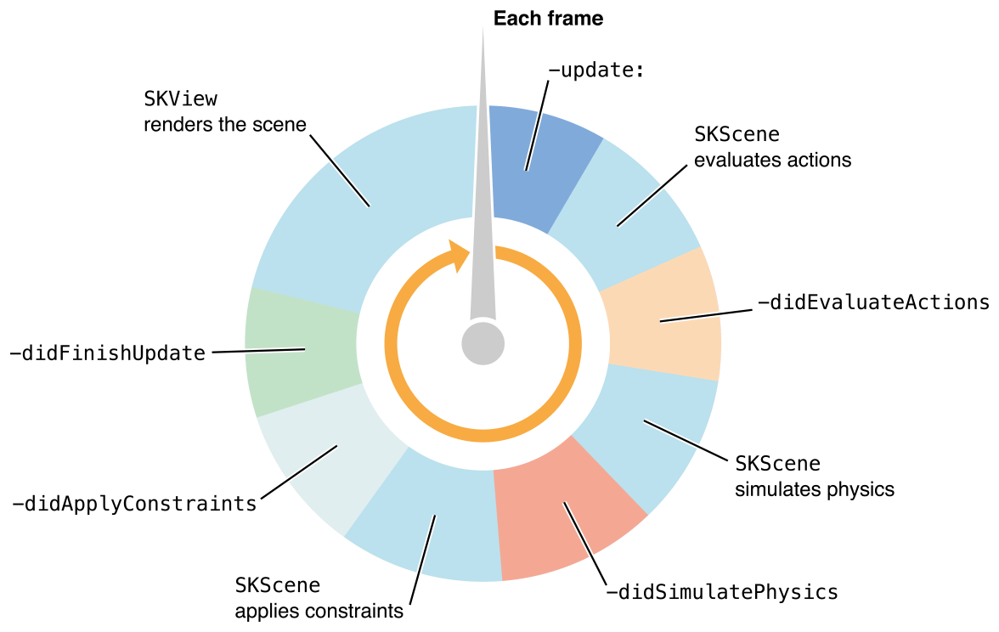
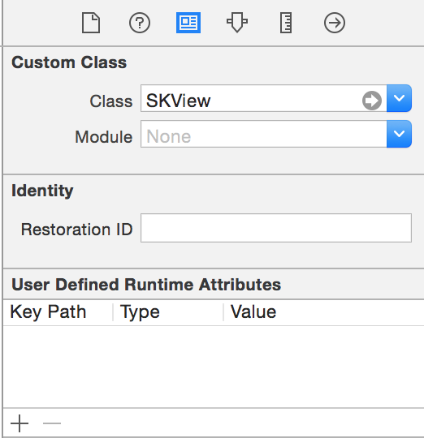

# [fit]PG5600
# [fit]iOS programmering
## Forelesning 9

---

# Sist gang

# [fit]App extensions

---

# Agenda

# [fit] Media

- Enkle 2D spill og Swift
- Video
- Lyd

---

# [fit]Sprite Kit

---

# Hva er det?

- Sprite Kit er et kraftfullt men enkelt rammeverk for iOS/Mac som hjelper oss å lage 2D spill
- Ikke nødvendig å laste ned noe mer eller ha ekterne avhengigheter
- Man kan bruke det sammen med andre iOS APIs
- Du kan bruke dine Swift og iOS kunnskaper
- Det er skrevet av Apple
- Det er gratis

---

# Hvordan fungerer det?

- Man animerer bilder/textures/sprites
- Bruker en loop for rendering av innhold til hver frame
- Ditt spill bestemmer innholde i scenen og hvordan innholde endrer seg i hver frame
- Inneholder funksjonalitet som musikkavspilling, fysikk simulering
- Kan kombineres med Core Animation

---



---

#[fit]DEMO AV SPILL

---

# SKView

- Står for animering og rendering
- Plasseres inn i et window
- Så legger man inn innholdet i SKView
- Siden SKView er et view så kan det kombineres med flere views

---



---

```swift


let skView = self.view as SKView
skView.showsFPS = true
skView.showsNodeCount = true
skView.ignoresSiblingOrder = true

```

---

# SKScene

- Innholde i ditt spill er organisert i scener
- En SKScene holder sprites og annet innhold som skal renderes
- SKScene implementerer per-frame logikk og innholdsprosessering
- Til en hver tid så presenterer SKView en SKScene
- Så lenge SKScene vises så kjører innholdet automatisk

---

```swift


class GameScene: SKScene {
    override func didMoveToView(view: SKView) {}
    override func touchesBegan(touches: NSSet, withEvent event: UIEvent) {}
    override func touchesMoved(touches: NSSet, withEvent event: UIEvent)  {}
    override func touchesEnded(touches: NSSet, withEvent event: UIEvent) {}
    override func update(currentTime: CFTimeInterval) {}
}


```

---

```swift


// Init en GameScene klassen vi definerte i forrige slide
let scene = GameScene(size: view.bounds.size)
scene.scaleMode = .AspectFill
skView.presentScene(scene)

```

---

# SKNode

- SKScene arver fra SKNode
- SKNode er byggeblokkene for alt innhold
- En SKScene oppfører seg som en root node i et tre av noder
- En scene og dets barn, bestemmer hvilke innhold som blir tegnet og hvordan det blir rendert

---

- Hver nodes posisjon er spesifisert i det kordinatsystemet som foreldren definerer
- Når en node er rotert så vil alle barn rotere også
- Alle node objekter er responder objekter og de arver fra UIResponer

---

# SKSpriteNode

- Arver også fra SKNode
- Brukes til å tegne texture bilde
- En farget firkant
- Et texture bilde blandet med en farge

---

```swift


let ball = Ball(imageNamed: "ball")
ball.position = CGPointMake(self.size.width/2, self.size.height/2);
self.addChild(self.ball)

```

---

# SKAction

- SKNodes til en SKScene blir animert ved hjelp av SKAction
- Noen actions bruker kun en frame for animasjon, mens andre actions går over flere frames
- Vanlig bruk er å animere endringer på en nodes properties
- Du kan lage grupper av actions som kjører samtidig eller i sekvens

---

```swift


let titleLabel = SKLabelNode(fontNamed: "HelveticaNeue")
titleLabel.text = "Start spillet";
titleLabel.position = CGPointMake(CGRectGetMidX(self.frame), CGRectGetMidY(self.frame));
titleLabel.fontSize = 50.0;

let angle = CGFloat(-M_PI*2)
let rotate = SKAction.rotateByAngle(angle, duration: 5.0)
let repeat = SKAction.repeatActionForever(rotate)
titleLabel.runAction(repeat)

self.addChild(titleLabel)
```

---

# SKPhysicsBody

- Brukes når noder skal samhandle med hverandre, for eksempel:
  - Kolidere
  - Gravisjon
- SKPhysicsBody legges på noder i SKScenen din
- En scene definerer global fysikk ved hjelp av SKPhysicsWorld

---

```swift


self.physicsBody = SKPhysicsBody(circleOfRadius: frame.size.width/2)
self.physicsBody?.friction = 0.0
self.physicsBody?.restitution = 1.0
self.physicsBody?.linearDamping = 0.0
self.physicsBody?.allowsRotation = false


self.physicsBody?.applyImpulse(CGVectorMake(15, -15))

```

---

# SKPhysicsBody properties

- mass - Bestemmer hvordan utvendig kraft påvirker body, og hvor mye moment den har når den koliderer
- friction - Ruhet til body, den brukes til å kalkulere friksjonskraften bodyen gir andre bodier i nœrheten
- linearDamping, angularDamping - Kalkulerer friksjons på en body når den beveger seg rundt i verden, kan brukes til å simulerer luft og vann friksjon

---

- restitution - Hvor mye energi bodyen beholder under kollisjon
- affectedByGravity - Avgjør om simulering utøver en gravitasjonskraft på body
- allowsRotation - Abgjør om krafter kan formidle vinkelhastighet på body

---

# SKPhysicsWorld properties

- gravity - Gjør at bodies i siumuleringen får akselasjon
- speed - Sier i hvilke fart simuleringen kjører

---

# SKTransition

- Brukes til å animere vekslingen mellom to SKScene som ligger på SKView
- Si for eksempel at du skal veksle mellom:
  - Laster scene
  - Deretter en meny
  - Så spillscenen

---

```swift


let scene = GameScene(size: self.size)
let transition = SKTransition.pushWithDirection(.Up, duration: 1)
self.view?.presentScene(scene, transition: transition)
```

---

# [fit]Demo

---

# Oppsummert

1. SKView -	Er subklasse av UIView.
2. SKScene - En spill scene som en tittel, instilling
3. SKTransition - Animerer mellom scener
4. SKSpriteNode - Textur bilde/farget rektangle
5. SKLabelNode - En node med en linje tekst
6. SKAction - Animering av noder

---

# Det finnes mange flere klasser i
# [fit]Sprite Kit

---

# [fit]Scene Kit
# 3D rammeverk fra Apple
# fungerer sammen med Sprite Kit

---

# For alternativer se for eksempel
# [fit] Unity

---

# [fit]Bilder

---

# Core Image

- Core Image er et kraftfullt rammeverk som er en del av Apple sin SDK
- Du kan enkelt bruke det til å legge på filter og effekter
- Du kan velge om man skal bruke CPU eller GPU til å prosessere bildene
- Eksempel på filter er invertering av farge og cropping

----

# Viktige klasser

CIContext - Prosessering av et core image objekt gjøres i en CIContext

CIImage - Holder på bildedata og kan lages av et UIImage, en bildefil eller av pixel data

CIFilter - Inneholder et sett med attributer som definerer hva slags filter som er representert

---

```swift

import AssetsLibrary

func applyFilter(image: CIImage) {
    let filter = CIFilter(name: "CIHueAdjust")
    filter.setValue(image, forKey: kCIInputImageKey)
    filter.setValue(100, forKey: kCIInputAngleKey)
    let context = CIContext(options:nil)

    let newImage = UIImage(CIImage: filter.outputImage)
    self.imageView.image = newImage

}
```

---

#[fit][Filter oversikt lenke](https://developer.apple.com/library/mac/documentation/graphicsimaging/Reference/CoreImageFilterReference/index.html#//apple_ref/doc/uid/TP40004346)

    https://developer.apple.com/library/mac/documentation/graphicsimaging/Reference/CoreImageFilterReference/index.html#//apple_ref/doc/uid/TP40004346

---

# Hastighet

- I eksempelet på sist slide så brukte vi ikke CIContext direkte
- ` UIImage(CIImage:)` lager automatisk et CIContext og legger på filterne
- Dette er ikke lurt å gjøre om man skal legge på filter realtime
- Da må man bruke en CIContext
- CIContext tar inne options som kan bestemme om det kjører på CPU eller GPU

---

```swift


let context = CIContext(options:nil)

func applyFilter(image: CIImage) {
    let filter = CIFilter(name: "CIHueAdjust")
    filter.setValue(image, forKey: kCIInputImageKey)
    filter.setValue(100, forKey: kCIInputAngleKey)

    let cgimg = context.createCGImage(filter.outputImage, fromRect: filter.outputImage.extent())

    let newImage = UIImage(CGImage: cgimg)
    self.imageView.image = newImage

}
```

---

# Hente opp bilder

---


---

```swift

@IBAction func loadPhoto(sender : AnyObject) {
  let picker = UIImagePickerController()
  picker.delegate = self
  self.presentViewController(picker, animated: true, completion: nil)
}

// UIImagePickerControllerDelegate

func imagePickerController(picker: UIImagePickerController!,
    didFinishPickingMediaWithInfo info: NSDictionary!) {

  self.dismissViewControllerAnimated(true, completion: nil);
  let gotImage = info[UIImagePickerControllerOriginalImage] as UIImage
  applyFilter(CIImage(image: gotImage))

}
```

---

# Lagre bilder

```swift


@IBAction func savePhoto(sender: AnyObject) {
    let imageToSave = CIImage(image: self.imageView.image)
    let softwareContext = CIContext(options:[kCIContextUseSoftwareRenderer: true])
    let cgimg = softwareContext.createCGImage(imageToSave, fromRect:imageToSave.extent())
    let library = ALAssetsLibrary()
    library.writeImageToSavedPhotosAlbum(cgimg,
        metadata:imageToSave.properties(),
        completionBlock:nil)
}
```

---

#[fit] Video

---

# Video fra bundle fil

```swift
import MediaPlayer

class VideoViewController: UIViewController {

    var moviePlayerController:MPMoviePlayerController!

    override func viewDidLoad() {
        super.viewDidLoad()

        if let fileURL = NSBundle.mainBundle().pathForResource("hunger", ofType: "mp4") {
            self.moviePlayerController = MPMoviePlayerController(contentURL: NSURL.fileURLWithPath(fileURL))
            self.moviePlayerController.prepareToPlay()
            self.moviePlayerController.view.frame = self.view.frame
            self.moviePlayerController.repeatMode = .One
            self.moviePlayerController.controlStyle = .Embedded
            self.view.addSubview(self.moviePlayerController.view)
            self.moviePlayerController.play()
        } else {
            println("Failed")
        }

    }

}


```

---

# Video fra bildestrøm

```swift

import MediaPlayer

...

func imagePickerController(picker: UIImagePickerController!,
    didFinishPickingMediaWithInfo info: NSDictionary!) {
        self.dismissViewControllerAnimated(true, completion: nil);
        let videoURL = info[UIImagePickerControllerMediaURL] as NSURL

        let videoController = MPMoviePlayerController(contentURL: videoURL)
        videoController.prepareToPlay()
        videoController.view.frame = self.view.frame
        videoController.repeatMode = .One
        videoController.controlStyle = .Embedded
        self.view.addSubview(videoController.view)
        videoController.play()
}

```

---

<br><br><br><br><br><br><br><br>


# [fit]MPMoviePlayerViewController
### Innebygd view controller som også kan brukes til å spille av video

---

# Ta opp video

```swift
import MobileCoreServices

...

@IBAction func captureVideo(sender: AnyObject) {
    if UIImagePickerController.isSourceTypeAvailable(UIImagePickerControllerSourceType.Camera) {
        let picker = UIImagePickerController()
        picker.delegate = self
        picker.allowsEditing = true
        picker.sourceType = UIImagePickerControllerSourceType.Camera;
        picker.mediaTypes = [kUTTypeMovie]
        self.presentViewController(picker, animated: true, completion: nil)
    }
}
```

---

# [fit] Lyd

---

```swift


import AVFoundation
```

---

```swift
var player:AVAudioPlayer!

...

func startPlaying() {

  var error: NSError?
  if let fileURL = NSBundle.mainBundle().
    URLForResource("Canton_Snow-Break-320",
    withExtension: "mp3") {
      self.player = AVAudioPlayer(contentsOfURL: fileURL, error: &error)

      if let e = error {
          println(e.localizedDescription)
          return
      }

      player.delegate = self
      player.volume = 1.0
      player.prepareToPlay()
      player.play()
  } else {
      println("could not load file")
  }
}
```
---

```swift


var player:AVAudioPlayer!

...

func stopPlaying() {
  if player.playing {
      player.stop()
  }
}
```

---

# En annen måte å støtte delegates

```swift


extension Sound : AVAudioPlayerDelegate {

    func audioPlayerDidFinishPlaying(player: AVAudioPlayer!, successfully flag: Bool) { }

    func audioPlayerDecodeErrorDidOccur(player: AVAudioPlayer!, error: NSError!) {}

}

```

---

# AVAudioSession

```swift

func setSessionPlayer() {
    let session = AVAudioSession.sharedInstance()
    var error: NSError?

    if !session.setCategory(AVAudioSessionCategorySoloAmbient, error:&error) {
        if let e = error {
            println(e.localizedDescription)
        }
    }

    if !session.setActive(true, error: &error) {
        if let e = error {
            println(e.localizedDescription)
        }
    }
}

```


---

# [fit]Oppgaver

##[fit] Se [Øvingsoppgavene](oppgaver.md)

##[fit] https://github.com/hinderberg/ios-swift-kurs
