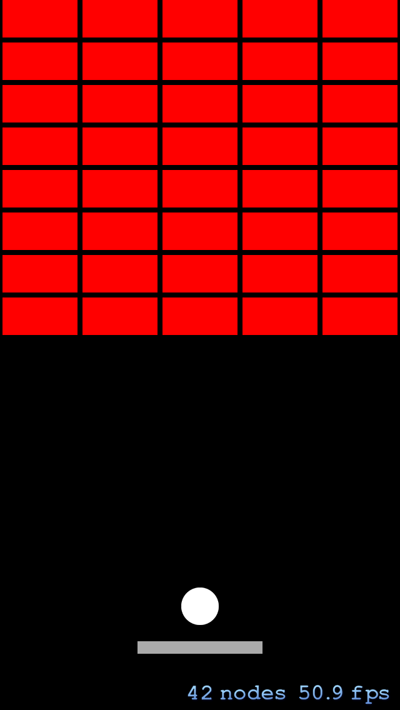

Øvingsoppgaver forelesning 9
================

Oppgave 1
----------------

Lag en [Breakout](http://en.wikipedia.org/wiki/Breakout_&#40;video_game&#41;) implementasjon i Swift ved hjelp av Sprite Kit

Den kan for eksempel se ut som dette:
    

Oppgave 2
----------------

Implementer en musikkavspiller

PS: Kan gjøres som en del av spillet

Oppgave 3
------------------

Implementer en enkel applikasjon som åpner et bilde og legger på et filter

Oppgave 3
----------------

Implementer en videoopptaker- og avspiller
