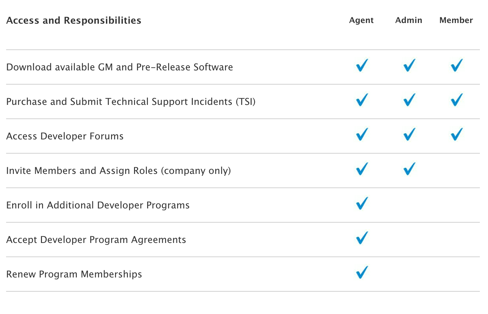
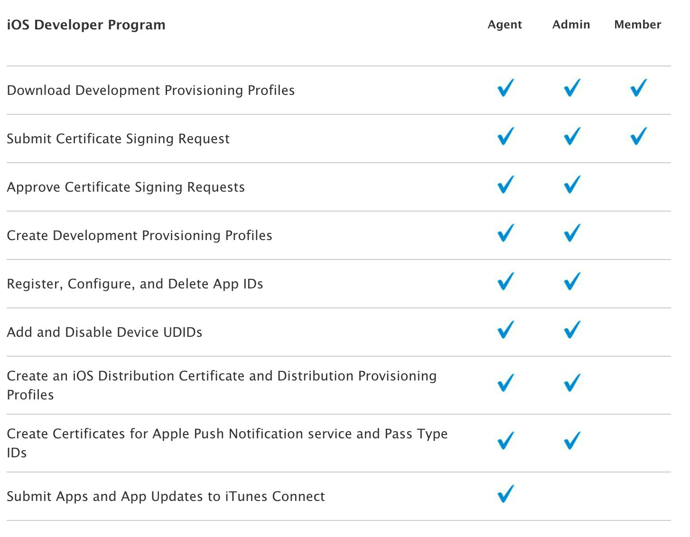
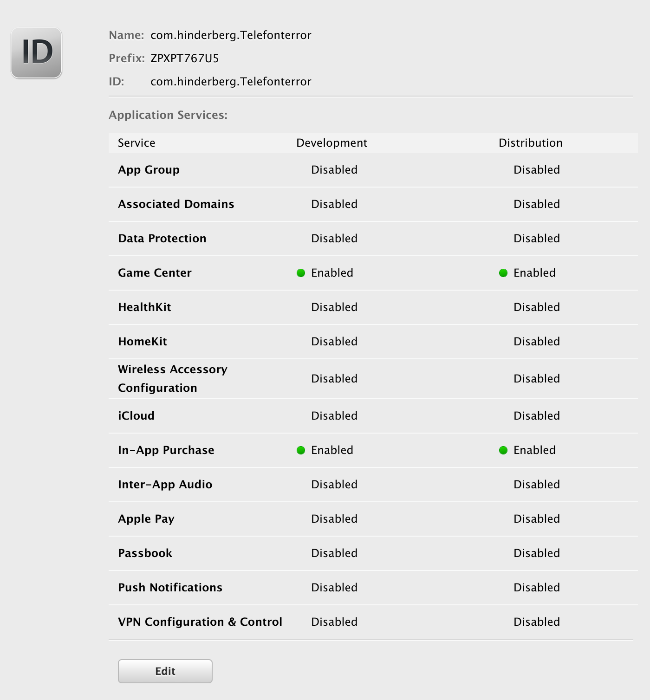
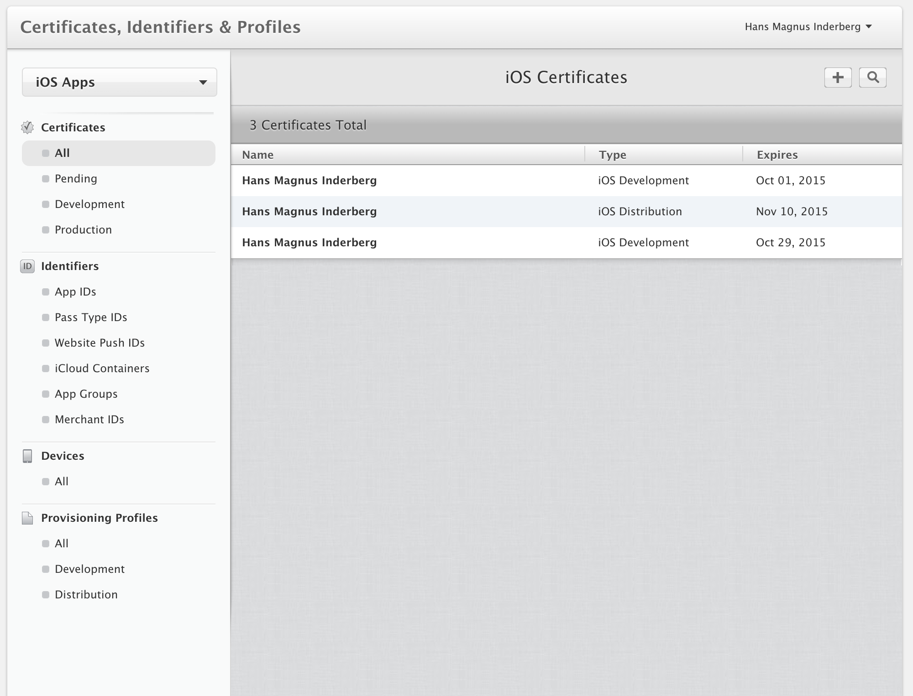
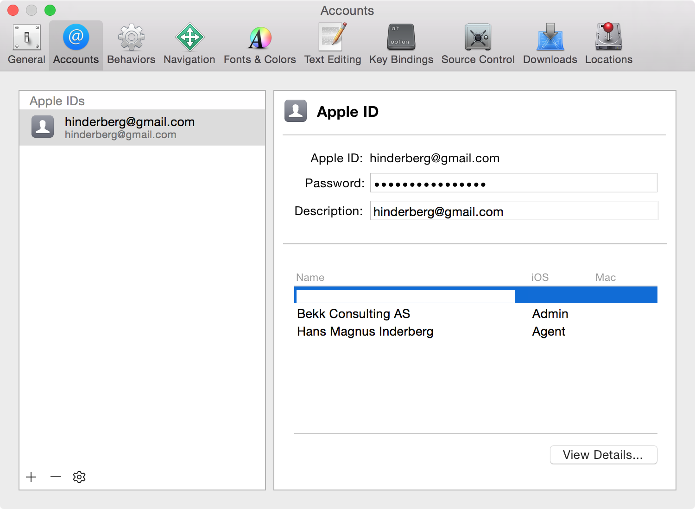
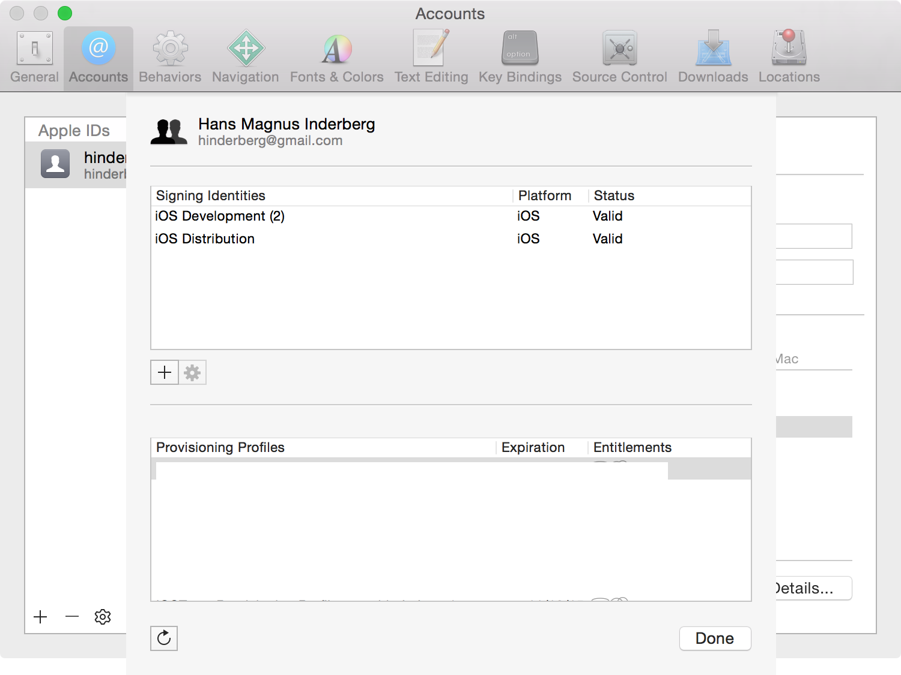
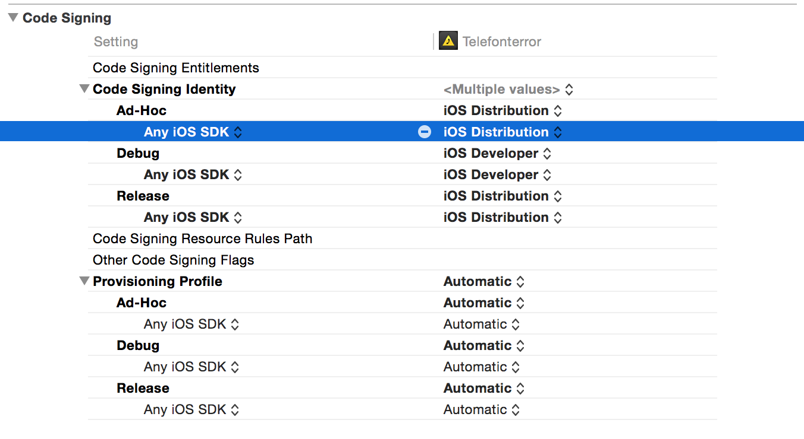
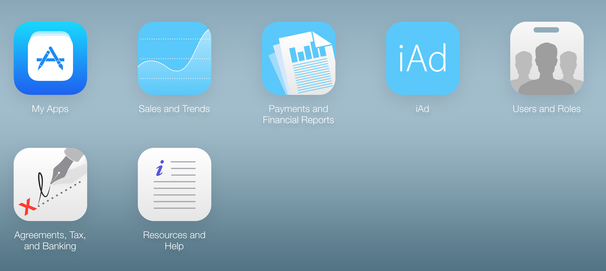
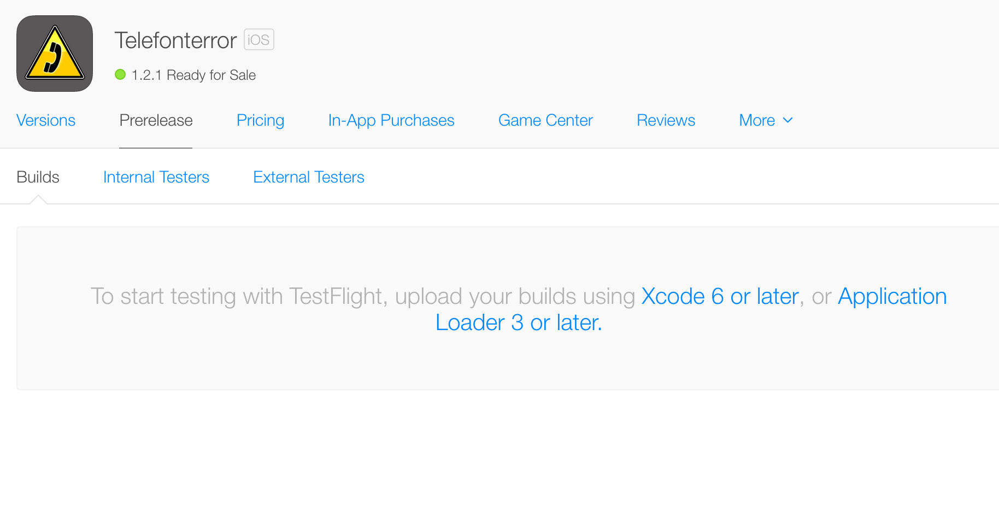

# [fit]PG5600
# [fit]iOS programmering
## Forelesning 11

---

# Sist gang

# [fit]Persistering

---

# Agenda

1. Utviklerprogrammer
2. Sertifikater & Provisjonsprofiler
3. Bygging og signering
4. Distribusjon og iTunes Connect
5. Betatesting
6. Gjennomgang av innleveringsoppgave

---

# [fit]Utviklerprogrammer

---

# iOS Developer Program - Individual ($99)

- Passer enkeltpersonforetak
- En utvikler
- Kan distribuere på App Store

---

# iOS Developer Program - Company ($99)

- For en bedrift
- Typisk der et eller flere team vil lage iOS Apps
- Kan distribuere på App Store

---

# iOS Developer Enterprise Program ($299)

- For en bedrift
- Her kan man lage applikasjoner for internbruk
- Kan ikke distribuere på App Store

---

# iOS Developer University Program (Gratis)

- Typisk for høyere utdanningsinstitusjoner
- Westerdals har ikke fått dette på plass enda, da de ikke har fått igjennom navnbytte fra NITH

---

# [fit] Utviklerprogrammer og roller

---



---



---

# [fit]Sertifikater & Provisjonsprofiler

---

# App ID

- En unik identifikator for applikasjonen din
- Inneholder to deler
  - App ID Prefix - 10-chars hexadecimal streng, default din team ID
  - App ID Suffix (Bundle Identifier) - Eksplisitt (Game Center, In-App Purchase, Data Protection og iCloud) eller Wildcard
- Kan lages manuelt eller lages med Xcode

---



---

# Distribusjonssertifikat

- Et sertifikat som forteller noe om identieten til den som publiserer applikasjonen
- Kan bare lages av `Team Agents`
- Har bare typisk ett av disse
- Kan lages manuelt eller lages med Xcode

---

# Lag et distribusjonssertifikat - del 1

- Logg inn på `Apple Developer Member Center`
- Klikk på linken `Certificates, Identifiers & Profiles`
- Venstre meny, klikk `All` under `Certificates`, deretter `(+)` knappen
- Velg `App Store and Ad Hoc` og klikk `Continue`

---

# Lag et distribusjonssertifikat - del 2

- Følg introduksjonen for å lage en `Certificate Signing Request (CSR)`
- Last opp `CSR` og klikk Generate
- Trykk oppdater knappen i nettleser på `Certificates - All`
- Trykk `Approve`
- Last ned `*.cer` filen og dobbelklikk

---

# Provisjonsprofil for Distribusjon

- Inneholder informasjon om hvilke distribusjonssertifikat og App ID den tilhører
- Om du skal bruke den til Ad Hoc må du også velge enheter
- Kan lages automatisk med Xcode eller manuelt
- Er de som brukes for å tilate å installere på en enhet

---

#[fit] `Sertifikater, App Idr & Profiler`
#[fit] Demo

---



---

#[fit] Bygging og signering

---

# [fit]Bygging og signering med Xcode
# [fit]Demo

---



---



---



---

# [fit]Bygging og signering med Terminalen

---

# xcodebuild

- Er det som ligger bak når man bruker Xcode til å bygge
- Når du bruker "Build & Run" knappen er det xcodebuild som blir trigget
- Man invoker med paramtre som lager og starter en .ipa fil på device eller simulator
- Fordelen er at man kan lage sine egne byggprosesser

---

```sh

#!/bin/sh

OUTPUTDIR="./build"
APPNAME="app name"
SCHEME="app scheme"
APP_WORKSPACE="Path/To/app.xcworkspace"

rm "$OUTPUTDIR/$APPNAME.ipa"
xcodebuild -workspace "$APP_WORKSPACE"
  -scheme "$SCHEME"
  archive -archivePath "$OUTPUTDIR/$APPNAME.xcarchive"

xcodebuild -exportArchive -exportFormat ipa
  -archivePath "$OUTPUTDIR/$APPNAME.xcarchive"
  -exportPath "$OUTPUTDIR/$APPNAME.ipa"
```

---

#[fit]xcodebuild gjennomgang i terminalen

---

#[fit]???

---

# xctool

- Erstattning for xcodebuild
- Har til hensikt å gjøre det enklere å bygge og teste iOS og OS X prosjekter
- Laget av Fred Potter og hans team hos Facebook

---

# [fit] Farger og mindre tekst!

---


---

# [fit]Støtte for flere
# [fit]rapporteringsformater

---

- pretty: textbasert som bruker ANSI farger og unicode symboler for fin output (default)
- plain: lik pretty, men uten farger og unicode symboler
- phabricator: JSON array som kan brukes inn i Phabricator (et code gjennomgang verktøy)
- junit: XML output som fungerer likt JUNIT test resultater
- user-notifications: MAC notification center
- med flere

---

```


path/to/xctool.sh \
  -workspace YourWorkspace.xcworkspace \
  -scheme YourScheme \
  build

```

---

```sh


path/to/xctool.sh \
  -workspace YourWorkspace.xcworkspace \
  -scheme YourScheme \
  test
```

---

# [fit]Kontinuerlig integrasjon og Kontinuerlig deploy

---

# Hvorfor?

- Kjøre tester hver gang en utvikler endrer koden
- Kan brukes til å bygge en produksjonsklar og testklar versjon av applikasjonen ved enhver endring
- Kan automatisk laste opp en app til en server så testere kan laste ned appen
- Kan i utgangspunktet automatisere opplasting til App Store for en app

---

# Forskjellige kontinuerlig integrasjons servere

- Travis CI - er en kontinuerlig integrasjons server som du slipper å kjøre selv. Tett integrert med GitHub
- Xcode Bots - Apple sin server (krever OSX Server)
- Jenkins - Open Source server som er lett å sette opp og lett å utvide

---

# Jenkins og xctool

- Fungerer utmerket og er det vi bruker på flere prosjekter
- Lett å sette opp
- Lett å komme i gang
- Hvorfor ikke Xcode Bots? Lite konfigurerbart og lite kontroll enn så lenge - støtter ikke flere plattformer

---

#[fit] Gjennomgang av kode med eksempel fra et pågående prosjekt

---

#[fit] Distribusjon og iTunes Connect

---

# [fit]App Store Review Guidelines

---

#[fit] Tenkt på barna
<br/>

### "We have lots of kids downloading lots of Apps. Parental controls work great to protect kids, but you have to do your part too. So know that we're keeping an eye out for the kids."

---

#[fit] Nyttig, unik, varig underholdning
<br/>

### "We have over a million Apps in the App Store. If your App doesn't do something useful, unique or provide some form of lasting entertainment, or if your app is plain ***creepy***, it may not be accepted."

---

#[fit] Kastet sammen
<br/>

### "If your App looks like it was cobbled together in a few days, or you're trying to get your first practice App into the store to impress your friends, please brace yourself for rejection. We have lots of serious developers who don't want their quality Apps to be surrounded by amateur hour."

---

# [fit]Går over streken
<br/>

### "We will reject Apps for any content or behavior that we believe is over the line. What line, you ask? Well, as a Supreme Court Justice once said, "I'll know it when I see it". And we think that you will also know it when you cross it."

---

# [fit] Du kan klade

<br/>
### "If your App is rejected, we have a Review Board that you can appeal to. If you run to the press and trash us, it never helps."

---

# [fit] Ikke prøv å lur Apple og deres systemer
<br/>

### "If you attempt to cheat the system (for example, by trying to trick the review process, steal data from users, copy another developer's work, or manipulate the ratings) your Apps will be removed from the store and you will be expelled from the developer program."

---

# [fit] Dokumentet endrer seg
<br/>

### "This is a living document, and new Apps presenting new questions may result in new rules at any time. Perhaps your App will trigger this."
<br/>

#[fit][Guidelines](https://developer.apple.com/app-store/review/guidelines/)

---

# [fit] iTunes Connect Demo

---



---

#[fit] Beta testing

---

# To enkle måter

- Signere appene med enterprisesertifikat og legge de ut på en server
- Test Flight

---

#[fit]TestFlight Demo

---



---

# [fit]Oppsumering
# [fit]Jeg vil ha ut min første iOS app!

---

- Kjøp et utviklerprogram
- Lag en App ID
- Lag og installer et distribusjonssertifikat
- Lag og installer en provisjonsprofil for produksjon
- Bygg appen din med provisjonsprofilen og sertifikatet
- Opprett app i iTunes Connect m/metadata
- Last opp applikasjonen til iTunes Connect
- `Submit` til App Store

---

# [fit]Gjennomgang av innleveringsoppgave

---

# [fit]Oppgave

##[fit] Se its learning

##[fit] https://github.com/hinderberg/ios-swift-kurs
