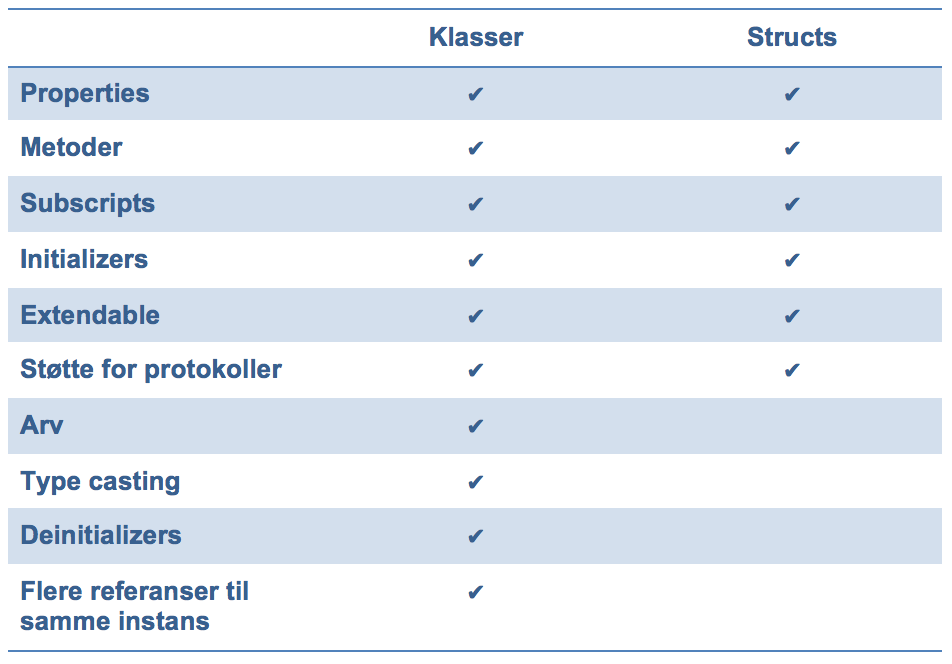

# _PG5600_ iOS programmering
## Forelesning 2

---

# Agenda - Swift del 2

* Funksjoner
* Closures
* Enumeration
* Klasser og structs
* Properties
* Metoder
* Access control

---

# Funksjoner

---

```swift
// Globale som standard
func hello() {
    // Kan nøstes
    func world() {
        println("World")
    }
    println("Hello")
    world()
}

hello()
```

---

# Funksjoner med returverdi


```swift
func hello() -> String {
    return "Hello World"
}

println(hello())
```

---

# Funksjoner med optional returverdi

```swift
func hello() -> String? {
    return nil
}

println(hello())
```

---

# Funksjoner med multiple return

```swift
func error() -> (code: Int, message: String) {
    return (500, "Internal server error")
}

println(error().message)
```

---

# Funksjoner med parametere

```swift
func greet(prefix: String, name: String) {
    println("Hello, \(prefix) \(name)!")
}

greet("Mr", "Anderson")
```

---

# Funksjoner med default-parametere

Defaultparamtere til slutt:

```swift
func greet(name: String, prefix: String = "") {
    println("Hello, \(prefix) \(name)!")
}

greet("Anderson")
greet("Anderson", prefix: "Mr")
```

---

# Utelat navn ved kall

Som regel ikke å anbefale pga. lesbarhet, men greit å kjenne til

```swift
// Merk _ foran prefix:
func greet(name: String, _ prefix: String = "") {
    println("Hello, \(prefix) \(name)!")
}

greet("Anderson")
greet("Anderson", "Mr")
```

---

# Funksjoner med navngitte parametere

```swift
func greet(prefix p: String, name n: String) {
    println("Hello, \(p) \(n)!")
}

// Navn MÅ brukes når funksjonen kalles
greet(prefix: "Mr", name: "Anderson")
```

---

# Funksjoner med navngitte parametere, alt 2

```swift
// # = samme navn internt/eksternt
func greet(#prefix: String, #name: String) {
    println("Hello, \(prefix) \(name)!")
}

greet(prefix: "Mr", name: "Anderson")
```

---

# Funksjoner med varargs (variadic)

```swift
func greet(names: String...) {
    for name in names {
        println("Hello \(name)")
    }
}

greet("Agent Smith", "Mr. Anderson")
```

* Maks ett
* Alltid til slutt i parameterlisten (også etter default parametere, om de finnes)

---

# Funksjoner som endrer på parameterne, internt

```swift
// Må ha var foran parameternavn
func swapInts(var first: Int, var second: Int) {
    let temp = first
    first = second
    second = temp
    // endringer synlig her
}

var a = 10
var b = 5
swapInts(a, b)
// men ikke her
```
---

# Funksjoner som endrer på parameterne, eksternt

```swift
// Må bruke inout foran parameternavn
func swapInts(inout first: Int, inout second: Int) {
    let temp = first
    first = second
    second = temp
    // endringer synlig her
}

var a = 10
var b = 5
// Må kalles med & foran parametere
swapInts(&a, &b)
// OG HER :-)
```

---

# Funksjoner som returnerer/tar imot andre funksjoner

---

```swift
func createFunction() -> () -> String {
    func helloWorld() -> String {
        return "Hello world"
    }
    return helloWorld
}

func invokeFunction(fn: () -> String, #times: Int) {
    for var i = 0; i < times; i++ {
        println(fn())
    }
}

// Funksjon som lager en funksjon
let fn = createFunction()

// Kan kalles direkte
println(fn())

// Eller sendes videre til annen funksjon
invokeFunction(fn, times: 3)
```

---

# Closures

## Aka blokker (obj-c), lamdas, anonyme funksjoner

---

# Closures - syntaks

```swift
{ (parametere) -> returntype in
    uttrykk
}
```

---

# Closures - syntaks

```swift
let arr = [1, 2, 3, 4, 5]

// -> [10, 20, 30, 40, 50]
arr.map({(n: Int) -> Int in
    return n * 10
})
```

---

# Closures - syntaks

```swift
let arr = [1, 2, 3, 4, 5]

// -> [10, 20, 30, 40, 50]
arr.map({n in n * 10 })
```
* Type inference
* Implisitt return for enkeltlinje-uttrykk

---

# Closures - syntaks

```swift
let arr = [1, 2, 3, 4, 5]

// -> [10, 20, 30, 40, 50]
arr.map({$0 * 10 })
```
* Shorcuts til parameternavn $0, $1, $2, osv.

---

# Trailing closures

```swift
let arr = [1, 2, 3, 4, 5]

// closures kan settes utenfor parenteser
arr.map(){$0 * 10}

// Og parenteser er valgfritt dersom metoden
// ikke tar inn parametere, som map:
arr.map {$0 * 10}
```

---

# Enumerations

---

```swift
enum Vaskeprogram {
    case IkkeValgt
    case Bomull
    case Ull
    case Syntetisk
}

var program = Vaskeprogram.IkkeValgt
program = .Bomull

```

---

# Classes and structs

---

```swift
struct POI {
    //... ?
}
class Server {
    //... ?
}
```

---



---

# Bruk structs når

* Hovedhensikten er å strukturere noen enkle verdier
* Du ønsker at dataene skal kopieres fremfor refereres
* Du ikke trenger arv

I andre tilfeller: bruk klasser

---

# Structs

```swift
struct POI {
    var lat: Double = 0
    var long: Double = 0
    var name: String?
}

// har initializer som standard:
let p = POI(lat: 59.91126, long: 10.76046, name: "Westerdals")
println("\(p.name) @ \(p.lat),\(p.long)")

var p2 = p // <-- kopi
p2.name = "NITH"
// p1.name er fortsatt Westerdals
```

---

# Pass by value vs. reference

* Structs (inkl. Stringer, Arrays og Dictionaries), Int og Enums er datatyper med pass by value, og som kopieres når de sendes rundt
* Ikke så skummelt som det høres ut som, Swift optimaliserer slik at kopiering bare skjer når det er helt nødvendig
* Klasser, funksjoner og closures sendes som referanser og kopieres ikke

---

# Klasser

```swift
// Deklarere
class Server {
    // Stored properties - ikke instansvariabler
    var ip: String
    var startTime : NSDate?
    var running = false

    // Konstruktør
    init(ip: String) {
        self.ip = ip
    }
}
// Instansiere
let server = Server(ip: "192.168.0.1")
```

---

# Metoder

```swift
class Server {
    // ...
    func boot() {
        startTime = NSDate()
    }
}

let server = Server(ip: "192.168.0.1")
server.boot()
NSThread.sleepForTimeInterval(5)
println("Up for \(server.uptime) seconds")
```

---

# Metoder

* For structs, klasser, enums
* Samme syntaks som funksjoner
* `self` refererer til instansen, på samme måte som `this` i andre språk
* Eksplisitt navngiving som standard, for 2...N parameter:

```swift
func install(package: String, version: String) {}
server.install("swift", version: "1.0.0")
```

---

# Properties

* Stored properties (klasser, structs)
* Computed properties (klasser, structs og enums)

---

# Computed properties

```swift
class Server {
    // ...
    // computed properties
    var uptime : Int {
        get {
            if let start = startTime {
                return Int(NSDate().timeIntervalSinceDate(start))
            } else {
                return 0
            }
        }
        /* Også mulig å sette, om ønskelig:
        set(newValue) {...}
        */
    }
}

let server = Server(ip: "192.168.0.1")
server.boot()
NSThread.sleepForTimeInterval(5)
println("Up for \(server.uptime) seconds")
```

---

# Property observers

```swift
class Server {
    var ip: String {
        willSet(newIp) {
            println("Kommer til å sette ip til \(newIp)")
        }
        didSet {
            println("Satte ip til \(ip)")
        }
    }
}
```
---

# Type properties/type methods - (aka static)

Opererer på typenivå (klasse/struct), uten at man trenger en instans

---

# Eksempel for klasser

```swift
class KlasseUtils {
    class var typeProperty: Int {
        get {
            return 1
        }
    }
    class func typeMethod() {}
}
KlasseUtils.typeProperty
KlasseUtils.typeMethod()
```

---

# Eksempel for structs

```swift
struct StructUtils {
    static var typeProperty: Int = 0
    static func typeMethod() {}
}

StructUtils.typeProperty
StructUtils.typeMethod()
```

---

# Access control

* Swift defaulter til fornuftig access control, derfor ikke alltid nødvendig å tenke på dette
* Blir viktig når man lager biblioteker
* Som standard internal

```swift
class SomeInternalClass {}              // implisitt internal
var someInternalConstant = 0            // implisitt internal
```

---

# Definer module

“A module is a single unit of code distribution—a framework or application that is built and shipped as a single entity and that can be imported by another module with Swift’s import keyword.”

Excerpt From: Apple Inc. “The Swift Programming Language.” iBooks. https://itun.es/no/jEUH0.l

---

# Nivåer

Kortversjonen

* `private` - skjules utad
* `internal` - tilgjengelig i samme modul
* `public` - tilgjengelig også for andre moduler

---

# Oppgaver

## Se [Øvingsoppgavene](oppgaver2.md)
