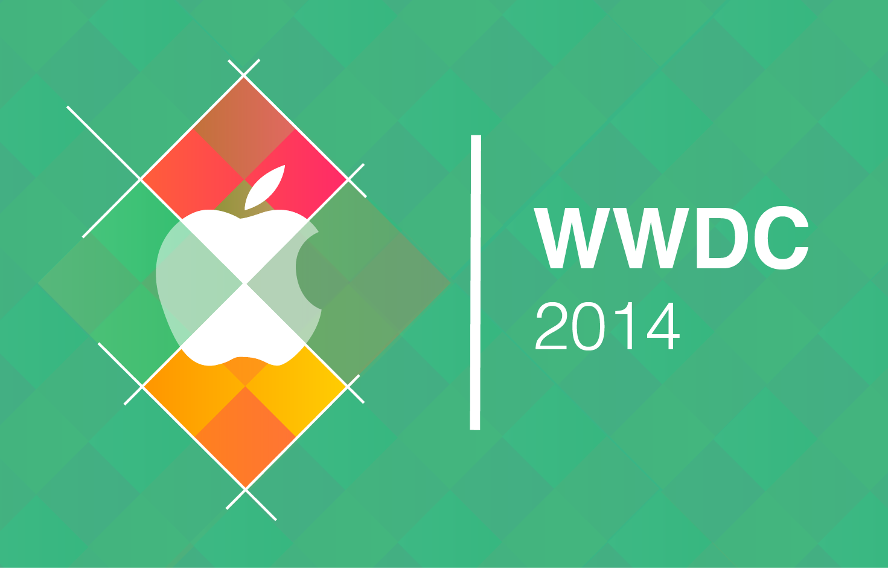
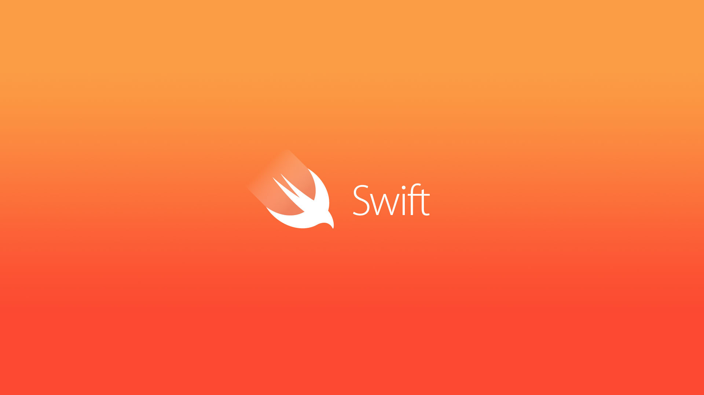
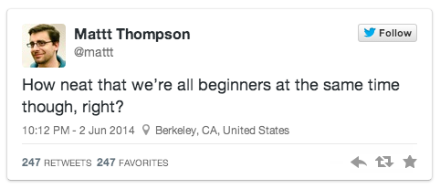

# [fit] Velkommen
### Introduksjon til _Swift_

---

### Hans Magnus Inderberg
#### BEKK, SpareBank 1 Mobilbank
#### Fagleder Mobil
#### _@hinderberg_

---



^ Under utviklerkonferansen WWDC i starten av Juni, lanserte Apple ganske så uventet et nytt programmeringsspråk kalt Swift.

---



^ kalt Swift.

^Et nytt programmeringsspråk for iOS og OS X

---

## Som førte til reaksjoner som dette


---

## og dette



---

#### _Som igjen førte til_

## Introduksjon til Swift

---

# Agenda

1. _Hva er swift og hvordan ser det ut?_
2. _Lettvekt og syntax_
3. _Litt mer avansert_
2. _Playground_
3. _REPL_

---

# Hva er Swift?
* _Et programmeringsspråk laget av Apple_
* _Fokus på Enkelhet_
* _Sikkerhet, moderne og kraf_
* _Fungerer side-om-side med Objetice-C_
* _Paradigmer som imperativ, OOP og funksjonelt_  

^ Swift er laget av Apple og tar i bruk mange kjente paradigmer og  som vi kjenner fra andre språk.
De sier at språket har fokus på sikkerhet og det merkes ved at kompileren er
flink til å finne utvikler feil og at de tvinger utviklere til å bruke visse patterns når de utvikler.
Enkelheten kommer frem i den lette syntaxen, de har for eksempel fjernet semi-kolon.
Mye inspirasjon kan man si at har blitt hentet fra språk som .NET familien, spesielt
F#, Java, Lisp, JavaScript, Diverse funksjonelle språk.

---

# Hvordan ser det ut?

---

# Variabler og konstanter

```swift


var numberOfemployees: Int = 320
numberOfemployees = 500


let shortName: String = "BEKK"
```

^ Konstanter deklareres med LET og variabler med VAR
En konstant kan bare bli satt en gang, men det må ikke skje ved kompilering.
I Swift er det foretrukket å bruke konstanter og imutable verdier, med mindre noe skal endre seg
Dette vil blant annet gjøre det enklere i multi-treding og enklere for kompileren.

---

# Type inference
```swift


var numberOfemployees = 350
numberOfemployees = 500


let shortName = "BEKK"
```


^Type interence er et stort fokus punkt i Swift.
Det betyr med andre ord at du skjelden trenger å spesifisere typen. Men typen vil fortsatt vœre der.

^De analyserer både oppover og nedover i type-treet.
Det vil si at om du ikke spesifiserer typen, så vil det analysere output av det du setter variabelen din til for å finne typen.

^Men om du setter typen, så vi den typen overskrive den faktiske typen.
For eksempel hvis du setter en Double til å vœre Float.

---

# Unicode støtte


```swift


                   let 🌍 = "😩😛😵😘"
```


^Jada, du kan bruke emicons

---

# Strenger

```swift


var fullName = "Bekk"
fullName += " Consulting"
// variableString er nå Bekk Consulting"

let fullName = "Bekk"
fullName += " Consulting"
// error - constantString cannot be changed

```

---

# String Interpolation

```swift


let n1 = 10, n2 = 8
let mathString = "\(n1) ganger \(n2) er \(n1 * n2)"
//10 ganger 8 er 80
```

^Strenger kan kombineres ved hjelp av streng interpolation. Der man også kan skrive matematiske utrykk.
^Det er også laget broer mellom Objective-C sine NSString klasse og Swift String, noe som gjør at man kan benytte disse om hverandre.

---

# Collection types

_Det finnes to typer collections i Swift_

<br />

* _Arrays_
* _Dictionaries_


^ De vanlige typene finnes også i Swift

---

# Array

```swift
// Deklaring, merk ingen spesifisering av type

var jobs = ["Systemutvikler", "Prosjektleder", "Frontend-Utvikler"]

// Uthenting

jobs[0]
```

^ Et array deklareres på veldig standard måte, med to klammer. Uthenting er som vanlig.
Forskjellig fra objective-c er at type inference gjør at disse er typed arrays

---

```swift
// Modifisering

jobs.append("Rådgiver")
jobs += ["Rådgiver", "Backend-Utvikler"]
jobs[0] = "Backend-Utvikler"
jobs[2..<5] = ["Rådgiver", "Backend-Utvikler", "Prosjektleder"]
```

---

# Dicionary

```swift
// Deklaring

var jobs = ["Rådgiver" : 35, "Systemutvikler" : 21, "Prosjektleder" : 32]

// Uthenting

jobs["Systemutvikler"]

// Modifisering

people["Rådgiver"] = 45
people["Prosjektleder"] = 81
```

^ I dicionary så holdes ting på normalt nivå og mange av dere kjenner nok igjen dette fra andre språk.

---

# Løkker

_Det finnes fire typer løkker_

* _while_
* _do-while_
* _for_
* _for-in_

^ Ikke noe nytt her altså, og de gjøres på vanlig måte

---

# Ranges

```swift


for nr in 1...10 {
	println("\(nr) ganger 2 er \(nr*2)")
}

for nr in 1..<10 {
	println("\(nr) ganger 2 er \(nr*2)")
}

```

^_1…10 – Går fra 1 til 10. Og er kjent som en closed range._
 _1..<10 – Går fra 1 til 9. Og er kjent som en half-closed range_

---

# Control flow

* _if_
* _switch_

---

# if

* _Ikke noe nytt, paranters er optional_

```swift
if age <= 10 {
    println("Barn")
} else if age >= 80 {
    println("Gammel")
} else {
    println("I mellom en plass?;)")
}
```

---

# switch

_Her har de gått banans_

* _Du trenger ikke bruke break etter hver case_
* _Bruk hvilke som helst object i en switch_
* _switch'ene må matche alle case, hvis du utelater default case,
hvis ikke blir det compile error_

---

```swift
switch age {
case 1,2,3,4,5,6,7,8,9,10:
    println("Du er et barn!")
case 80...100:
    println("Du er gammal!")
default:
    println("I mellom en plass?;)")
}
```

---

# Du kan switche på instanser

``` swift
switch sender {
  case childButton:
    println("Du er et barn!")
  case oldisButton:
    println("Du er gammal!")
  default:
    println("I mellom en plass?;)")
}
```

^ Man kan også switche på instanster av forskjellige typer.

---

# Optionals

---

```swift
var possibleWelcomeMessage: String? = "Halloo"

if possibleWelcomeMessage == nil {
	println("Det er ingen streng her!")
} else {
	// unwrapping med !
	let welcomeMessage = possibleWelcomeMessage!
	println(welcomeMessage)
}
```

^Greit å vite at typer som ikke er optinal kan ikke vœre nil.
Da får man kompile error

---

```swift
if let welcomeMessage = possibleWelcomeMessage {
		println(welcomeMessage)
}
```

^Automatisk unwrapping og sette verdien i en if

---

# Optional chaining

```swift
if let street = bekk.people.first?.address?.street {
    println("Personen bor i \(street).")
} else {
    println("Kunne ikke hente gatenavn")
}
```

---

# Funksjoner

* _Deklareres med `func`_
* _Returtypen defineres til slutt_

---

```swift
func printName() {
  println("Olga")
}

printName()
```

---

```swift
// med parametre
// default konstanter
// hvis ikke spesifisert at de skal vœre variabler
// med da blir de kopiert. Med mindre man bruker `inout`

func printName(name: String) {
  println(name)
}

printName("Olga")
```

---

```swift
// med default verdi

func printName(name: String = "Olga") {
  println("Hallo \(name)!")
}
printName()
printName(name: "Geir")
```
---

# Funksjoner - Returverdi

```swift


func buildName(firstName: String, lastName: String) -> String {
	return "\(firstName) \(lastName)"
}

let fullName = buildName("Olga", "Geiresen")
```
---

# Funksjoner - Navngitte parametre

```swift


func buildName(
    yourFirstName firstName: String,
    #lastName: String) -> String {
        return "\(firstName) \(lastName)"
}

buildName(yourFirstName: "Olga", lastName: "Geiresen")
```
---

# Funksjoner - Tuple/Flere returverdier

```swift


func refreshWebPage() -> (Int, String) {
  return (200, "success")
}

let (statusCode, message) = refreshWebPage()
println("Fikk status \(statusCode): \(message)")
```

---

```swift

// Navngi felter i tuple returverdi

func refreshWebPage() -> (code: Int, message: String) {
  return (200, "success")
}

let status = refreshWebPage()
println("Fikk status \(status.code): \(status.message)")
```
---

# Funksjoner - Med x antall av samme type

```swift
func total(numbers: Double...) -> Double {
    var total: Double = 0
    for number in numbers {
        total += number
    }
    return total;
}

total(1, 2, 3, 4, 5)
```

---

# Funksjoner - som parametre

```swift
func addTwoInts(a: Int, b: Int) -> Int {
    return a + b
}

func printMathResult(mathFunction: (Int, Int) -> Int,
	a: Int, b: Int) {
    println("Ble: \(mathFunction(a, b))")
}

printMathResult(addTwoInts, 3, 5)
```

---

# Nestede funksjoner

---

```swift
func jump(method: String) -> (Int) -> String {
    func vertizal(lenght: Int) -> String { return "Jeg hoppet \(lenght)m fremover" }
    func horizontal(height: Int) -> String { return "Jeg hoppet \(height)m høyt" }
    func notJumping(lenght: Int) -> String { return "Jeg droppet å hoppe \(lenght)m" }

    if method  == "vertical" {
        return vertizal
    } else if method == "horizontal" {
        return horizontal
    } else {
        return notJumping
    }
}

println(jump("vertical")(1))
println(jump("horizontal")(2))
println(jump("")(2))
```

---

# Closures

```swift
{ (parameters) -> return type in
    statements
}
```

^ Samme som funksjoner, bare uten navn!

---

```swift
reversed = sorted(names, { (s1: String, s2: String) -> Bool in
    return s1 > s2
})
```
---

# Closures på speed

---

```swift
// Type inference

reversed = sorted(names, { s1, s2 in return s1 > s2 } )
```

---

```swift
// Implicit Returns from Single-Expression Closures

reversed = sorted(names, { s1, s2 in s1 > s2 } )
```

---

```swift
// Shorthand arguments names

reversed = sorted(names, { $0 > $1 }
```

---

```swift
/*
Swift’s String type definerer sin
spesifikke implementasjon av > operatoren som en funksjon
som har to paramerte av typen string og returnerer Bool
*/
reversed = sorted(names, >)
```
---

# Closures som parametre

```swift
func repeat(count: Int, task: () -> ()) {
  for i in 0..<count {
    task()
  }
}

repeat(2, {
  println("BEKK!")
})
```

---

# Trailing closure
```swift
repeat(2) {
  println("BEKK!")
}
```

---

# Klasser og Structs

* _Klasser er Reference Types_
* _Structs er Value Types_

---

```swift
struct Resolution {
    var width = 0
    var height = 0
}

class VideoMode {
    var resolution = Resolution()
    var interlaced = false
    var frameRate = 0.0
    var name: String?
}
```

^Slipper endelig .h filer, trenger ikke arve av NSObject
Et eksempel på stored properties

---

# Klasser og structures har mye til felles
* _Definere properties_
* _Definere metoder_
* _Definere subscripts (snarveier for å hente verdier)_
* _Definere initializers for å sette opp state_
* _Kan bruke extentions_
* _Kan bruke protocols_

---

# Klasser kan i tillegg

* _Arv_
* _Type casting - man kan sjekke og tolke typen runtime_
* _`deinitializers` for opprydding når instansen blir kastet_
* _Referanse telling - mer enn en referanse til en klasseinstans_

^ Value Types blir kopiert når man assigner dem til en ny variabel eller konstant
Reference types øker bare antall pekere til det samme objektet.

---

# Eksempel

```swift
let hd = Resolution(width: 1920, height: 1080)
var cinema = hd
cinema.width = 1400
// her blir ikke hd endret

var mode = VideMode(name: "Kul modues")
sameMode = mode
sameMode.name = "En annen modus"
// Både mode og sameMode sitt name er En annen modus
```

^Legg merke til at man slipper alloc og eller new
Man har også konstruktører og de heter init

---

# Når bruke struct

* _Når du skal enkapsulere enkle dataverdier_
* _Når verdiene bør bli kopiert og ikke referert til_
* _Når alle properties i structuren er value types_
* _Når man ikke trenger arv fra andre typer_

Eksempel: _String, Array og Dictionary er structs_

---

# Access Control

* _Access Control på klasser, structs, metoder, properties, etc._

```swift
public class SomePublicClass {}
internal class SomeInternalClass {}
private class SomePrivateClass {}
```

^ Ligner veldig på for eksempel Java

---

# Kalkulerte properties

```swift
struct Rect {
    var origin = Point()
    var size = Size()
    var center: Point {
        get {
            let centerX = origin.x + (size.width / 2)
            let centerY = origin.y + (size.height / 2)
            return Point(x: centerX, y: centerY)
        }
        set(newCenter) { // må ikke ta inn noe, da kan man bruke newValue i stedet
            origin.x = newCenter.x - (size.width / 2)
            origin.y = newCenter.y - (size.height / 2)
        }
    }
}
```

---

# READ-only

```swift
struct Cuboid {
    var width = 0.0, height = 0.0, depth = 0.0
    var volume: Double {
        return width * height * depth
    }
}
```

---

# Obseravble properties

```swift
class StepCounter {
    var totalSteps: Int = 0 {
        willSet(newTotalSteps) {
            println("I ferd med å sette totalSteps til \(newTotalSteps)")
        }
        didSet {
            if totalSteps > oldValue  {
                println("La til \(totalSteps - oldValue) steg")
            }
        }
    }
}
```

---

# Metoder

```swift
class Counter {
    var count = 0
    func increment() {
        count++
    }
    func incrementBy(amount: Int) {
        count += amount
    }
    func reset() {
        count = 0
    }
}
```

---

# class, static

```swift
class SomeClass {
    class func someTypeMethod() {

    }
}

struct SomeStruct {
    static func someTypeMethod() {

    }
}
```

---

# Arv

* _Bruk final hvis du ikke ønsker at man skal kunne bruke override ved arv_

---

```swift
class Car: Vehicle {
    override func makeNoise() {
        println("Wrom wrom")
    }

    var gear = 1
    override var description: String {
        return super.description + " er i gir \(gear)"
    }

    override var currentSpeed: Double {
      didSet {
          gear = Int(currentSpeed / 10.0) + 1
      }
  	}
}
```

---

# Enums

```swift
enum CompassPoint {
    case North
    case South
    case East
    case West
}

enum Planet {
    case Mercury, Venus, Earth, Mars, Jupiter, Saturn, Uranus, Neptune
}

```

---

# Enums Raw og Associated verdier

```swift
// Enumeration Raw Values
enum ASCIIControlCharacter: Character {
    case Tab = "\t"
    case LineFeed = "\n"
    case CarriageReturn = "\r"
}

// Enumeration Associated Values
enum Barcode {
    case UPCA(Int, Int, Int, Int)
    case QRCode(String)
}
var productBarcode = Barcode.UPCA(8, 85909, 51226, 3)
productBarcode = .QRCode("ABCDEFGHIJKLMNOP")
```

^Kan ha konstruktører, funksjoner, variabler

---

# Protocols

* _Samme som interface i Java og andre språk_
* _Definerer opp et sett med metoder, properties, klasse metoder, operatorer og subscripts som passer en bestemt funksjonalitet_
* _Inneholder ingen implementasjonskode_

---

```swift
protocol SomeProtocol {
}
```

---

# Extentions

* _Utvide funksjonalitet for en bestemt type_

---

* _Vanlig og static kalkulerte properties_
* _Definere nye instansmetoder og klassemetoder_
* _Nye init metoder_
* _Nye subscripts_
* _Definere ny nestet type_
* _Gjøre slik at en eksiterende type conforms til en protocol_

---

```swift
extension String {
    // Legg til ny funksjonalitet på String
}
```

---

# Generics

* _Mye av Swift sitt standard bibliotek er bygd med generics kode_
* _For eksempel er Array og Dicionary typene generic collections_

---

```swift
func swapTwoValues<T>(inout a: T, inout b: T) {
    let temporaryA = a
    a = b
    b = temporaryA
}

var someInt = 3
var anotherInt = 107
swapTwoValues(&someInt, &anotherInt)

var someString = "hello"
var anotherString = "world"
swapTwoValues(&someString, &anotherString)
```

---

# Playground

* _Ligner på Scala Workspaces or F# interactive mode_
* _Kjører kode forløpende_
* _Tidslinje som skriver ut alt som skjer i en prosess_
* _Eksempelvis loops, komposisjon av views eller animert SpriteKit scene_

^ Ny algoritme, nye tester, utforske apier, rette en bestemt bug

---

# Playground Demo

---

# REPL

###### _read–eval–print loop støtte_
###### _Startes med ```xcrun swift```_

---

```swift
#!/usr/bin/env xcrun swift

import Cocoa
import Appkit

var arguments = Process.arguments;
arguments.removeAtIndex(0)

if arguments.count != 1 {
    println("Usage: ./wallpaper.swift -- [wallpaper path]")
    exit(1)
}

let path = arguments[0]
println("Finding wallpaper at path: \(path)")

let workspace = NSWorkspace.sharedWorkspace()
let screen = NSScreen.mainScreen()

let potensialImgUrl : NSURL? = NSURL.fileURLWithPath(path)
var error : NSError?

if let imageUrl = potensialImgUrl {
    let result : Bool = workspace.setDesktopImageURL(imageUrl, forScreen: screen, options: nil, error: &error)

    if result {
        println("Wallpaper set!")
    } else {
        println("Failed setting wallpaper")
    }
} else {
    println("There is something wrong with the path: \(path)")
}
```

---

# Swift er ikke ferdig

---

# [fit] Spørsmål _**[?]**_

---

# [fit] Gira?
# [fit] Stikk å programer Swift
# [fit] _**Lykke til!**_

---

# Ressurser

1. _https://developer.apple.com/videos/wwdc/2014/_
2. _https://developer.apple.com/swift/_
